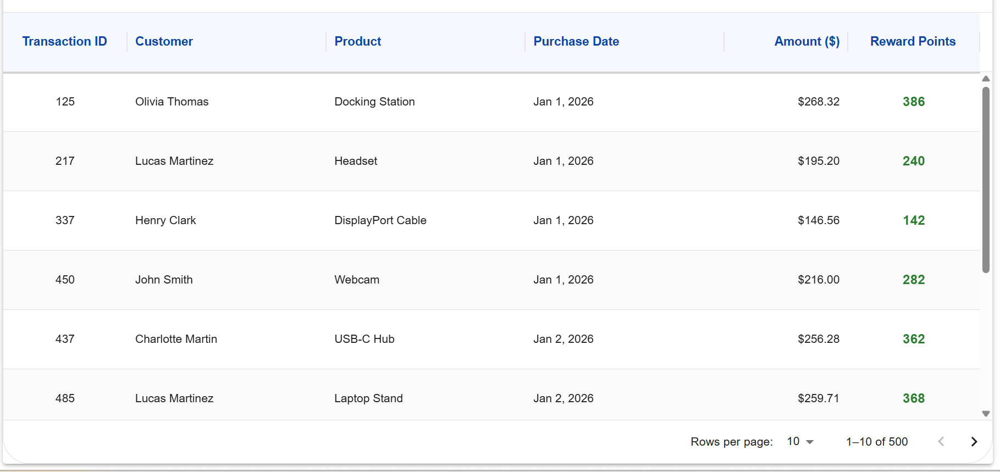
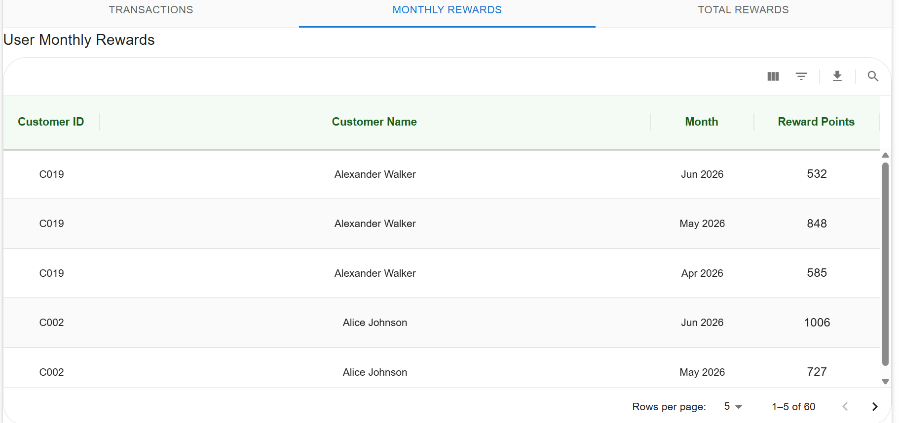
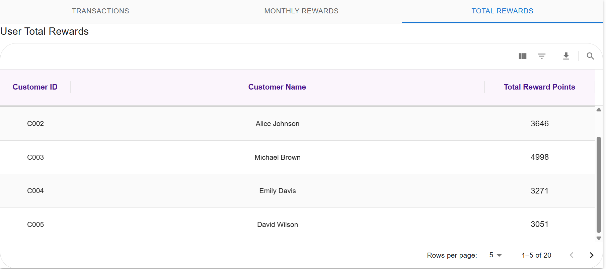
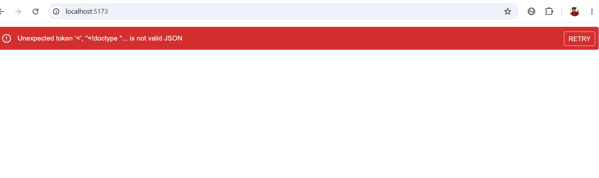
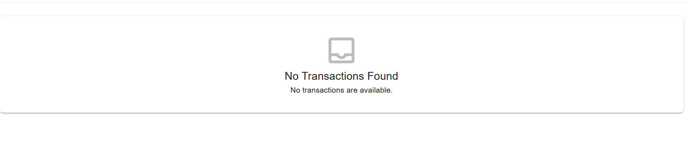

# 🎁 Reward Points Dashboard

A React-based dashboard that calculates and displays customer reward points based on their purchase history. The application aggregates transaction data into monthly and total reward summaries while providing a responsive, user-friendly interface built with Material UI DataGrid.

---

## Features

- Calculate reward points for every transaction
- Dashboard summary cards
  - Total Customers
  - Total Transactions
  - Total Reward Points
- Transaction history table
- Monthly reward summary table
- Total reward summary table
- Client-side pagination with automatic page reset on page size change
- Scrollable Material UI DataGrids
- Tab-based navigation between dashboard tables
- Lazy loading of dashboard tables using `React.lazy` and `Suspense`
- Loading, Error and Empty states
- Retry functionality for failed API requests
- AbortController support to cancel stale requests
- Response validation before processing API data
- Unit tested using Vitest and React Testing Library

---

## Reward Calculation Rules

Reward points are calculated per transaction using the following rules:

- No points for purchases up to **$50**
- **1 point** for every dollar spent between **$50 and $100**
- **2 points** for every dollar spent over **$100**

### Example

| Purchase Amount | Reward Points |
|----------------:|--------------:|
| $40 | 0 |
| $75 | 25 |
| $100 | 50 |
| $120 | 90 |
| $150 | 150 |

---

## Technology Stack

- React 19
- Material UI
- Material UI DataGrid
- Day.js
- React Hooks
- React Lazy / Suspense
- Fetch API
- AbortController
- Vitest
- React Testing Library

---

## Project Structure

```
src
│
├── api
│   └── transactionApi.js
│
├── components
│   ├── common
│   ├── dashboard
│   ├── rewards
│   └── transactions
│
├── constants
│
├── hooks
│   ├── usePaginationModel.js
│   ├── useRewardDashboard.js
│   └── useTransactions.js
│
├── pages
│   └── Dashboard.jsx
│
├── styles
│
├── tests
│
└── utils
    ├── calculateRewardPoints.js
    ├── dashboardUtils.js
    ├── monthlyRewardUtils.js
    ├── totalRewardUtils.js
    └── transactionUtils.js

public
└── db.json
```

---

## Application Flow

```
db.json
      │
      ▼
transactionApi.js
      │
      ▼
useTransactions
      │
      ▼
useRewardDashboard
      │
      ├──────────────► Dashboard Statistics
      ├──────────────► Monthly Rewards
      ├──────────────► Total Rewards
      └──────────────► Transactions with Rewards
                    │
                    ▼
                Dashboard
```

---

## Key Design Decisions

- Uses **Fetch API** instead of Axios for a lightweight data layer.
- Stores mock data in the **public** folder.
- Uses **AbortController** to prevent stale network updates.
- Uses **Map** for reward aggregation to improve readability and lookup efficiency.
- Uses **Day.js** for date handling instead of the legacy `Date` API.
- Separates table column definitions into reusable constants.
- Uses custom hooks to separate business logic from presentation.
- Memoizes expensive calculations using `useMemo`.
- Reusable pagination logic through a custom `usePaginationModel` hook.

---

## Error Handling

The application handles:

- Invalid purchase amounts
- Invalid API responses
- Failed network requests
- Loading state
- Empty state
- Retry support
- Graceful rendering using React Error Boundary

---

## Performance Optimizations

- React Lazy
- Suspense
- Memoized calculations (`useMemo`)
- Memoized components (`React.memo`)
- Request cancellation using AbortController
- Scrollable DataGrid instead of rendering the entire page

---

## Running the Project

Install dependencies

```bash
npm install
```

Start the development server

```bash
npm run dev
```

---

## Running Tests

Run all tests

```bash
npm test
```

Run tests in watch mode

```bash
npm run test:watch
```

Generate coverage

```bash
npm run test -- --coverage
```

---


## Screenshots

### Dashboard


### Transactions



### Monthly Rewards



### Total Rewards



### Error State



### Empty State



### Test Coverage


----------------------------|---------|----------|---------|---------|-------------------
File                        | % Stmts | % Branch | % Funcs | % Lines | Uncovered Line #s 
----------------------------|---------|----------|---------|---------|-------------------
All files                   |   98.15 |    92.59 |   94.54 |   98.06 |                   
 api                        |     100 |      100 |     100 |     100 |                   
  transactionApi.jsx        |     100 |      100 |     100 |     100 |                   
 components/common          |     100 |      100 |     100 |     100 |                   
  EmptyState.jsx            |     100 |      100 |     100 |     100 |                   
  ErrorFallback.jsx         |     100 |      100 |     100 |     100 |                   
  ErrorMessage.jsx          |     100 |      100 |     100 |     100 |                   
  Loader.jsx                |     100 |      100 |     100 |     100 |                   
 components/dashboard       |     100 |      100 |     100 |     100 |                   
  DashboardCards.jsx        |     100 |      100 |     100 |     100 |                   
  DashboardHeader.jsx       |     100 |      100 |     100 |     100 |                   
  SummaryCard.jsx           |     100 |      100 |     100 |     100 |                   
 components/rewards         |     100 |      100 |     100 |     100 |                   
  MonthlyRewardTable.jsx    |     100 |      100 |     100 |     100 |                   
  TotalRewardTable.jsx      |     100 |      100 |     100 |     100 |                   
 components/transactions    |     100 |      100 |     100 |     100 |                   
  TransactionTable.jsx      |     100 |      100 |     100 |     100 |                   
 constants                  |     100 |      100 |     100 |     100 |                   
  rewardConstants.jsx       |     100 |      100 |     100 |     100 |                   
  tableHeights.jsx          |     100 |      100 |     100 |     100 |                   
 constants/tableColumns     |     100 |    83.33 |     100 |     100 |                   
  monthlyRewardColumns.jsx  |     100 |      100 |     100 |     100 |                   
  totalRewardColumns.jsx    |     100 |       50 |     100 |     100 | 30                
  transactionColumns.jsx    |     100 |      100 |     100 |     100 |                   
 hooks                      |     100 |    83.33 |     100 |     100 |                   
  usePaginationModel.jsx    |     100 |      100 |     100 |     100 |                   
  useRewardDashboard.jsx    |     100 |      100 |     100 |     100 |                   
  useTransactions.jsx       |     100 |       75 |     100 |     100 | 36                
 pages                      |   83.33 |    85.71 |      40 |   83.33 |                   
  Dashboard.jsx             |   83.33 |    85.71 |      40 |   83.33 | 20,24,63          
 styles                     |     100 |      100 |     100 |     100 |                   
  dataGridStyles.jsx        |     100 |      100 |     100 |     100 |                   
 utils                      |     100 |      100 |     100 |     100 |                   
  calculateRewardPoints.jsx |     100 |      100 |     100 |     100 |                   
  dashboardUtils.jsx        |     100 |      100 |     100 |     100 |                   
  formatDate.jsx            |     100 |      100 |     100 |     100 |                   
  monthlyRewardUtils.jsx    |     100 |      100 |     100 |     100 |                   
  totalRewardUtils.jsx      |     100 |      100 |     100 |     100 |                   
  transactionUtils.jsx      |     100 |      100 |     100 |     100 |                   
----------------------------|---------|----------|---------|---------|-------------------
 PASS  

---

## Future Improvements

- Server-side pagination
- Sorting and filtering through API
- Export reports to CSV/Excel
- Authentication
- Dark mode
- Internationalization (i18n)
- Accessibility improvements


